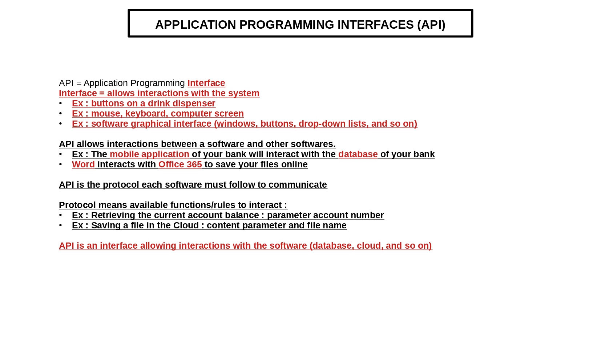
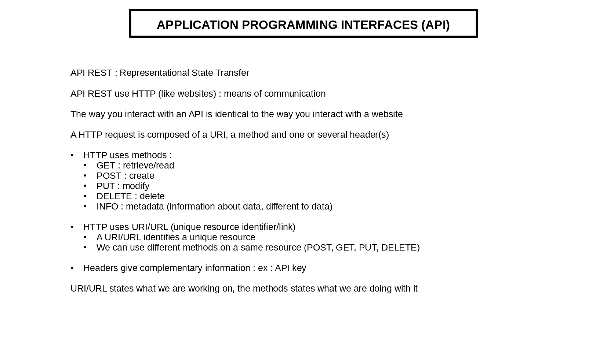
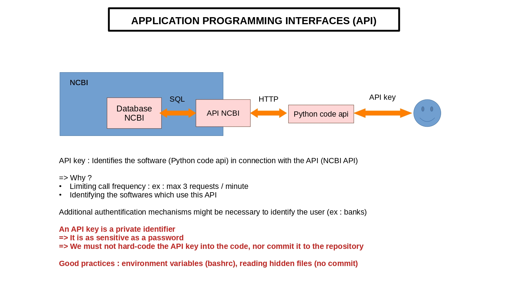

# Project about APIs

## Table of content

1. [Description](#descrp)
2. [Requirements](#req)
3. [Usage](#usage)
    - [Example 1: NCBI](#example-with-ncbi)
    - [Example 2: Ensembl](#example-with-ensembl) 
4. [Authors](#authors)
5. [References](#references)
    - [Tutorials](#tutorials)
    - [Articles](#articles)

<a name="descrp"></a>

## Description
The goal of this project is to learn about API (Application Programming Interfaces). We consider 2 public databases used for biological projects, NCBI and Ensembl, make different requests, and extract information from these databases.

API = Application Programming Interface
    = Interface between the user and the database (which stores the data).

Examples:

1. Buttons on the bank cash machine

2. Mouse, keyboard, computer screen, ...

3. Software user interface (windows, buttons, drop-down list, ...)





<a name="req"></a> 

## Requirements

#### Install miniconda3: 

[Miniconda](https://docs.conda.io/en/latest/miniconda.html#linux-installers)

#### Install Miniforge3 for Linux:

[Miniforge3](https://github.com/conda-forge/miniforge?tab=readme-ov-file)

Then, close and re-open your terminal window and run ```which mamba``` to see if mamba is well installed.

#### Install your environment from a .yml file:

[Environment](https://conda.io/projects/conda/en/latest/user-guide/tasks/manage-environments.html#activating-an-environment)

Please run the following command-line to install the conda environment: ```conda env create -f myenv.yml```
Please run ```conda activate env_api``` to activate the environment.


<a name="usage"></a>

## Usage

<a name="example-with-ncbi"></a>

### Example with NCBI

<a name="example-with-ensembl"></a>

### Example with Ensembl

<a name="authors"></a>

## Authors
This project is developed by Chloé Aujoulat.

<a name="references"></a>

## References

<a name="tutorials"></a>

### Tutorials

- [ncbi_documentation](https://www.ncbi.nlm.nih.gov/datasets/docs/v2/)
- [what_is_a_url](https://developer.mozilla.org/en-US/docs/Learn_web_development/Howto/Web_mechanics/What_is_a_URL)
- [ncbi_api](https://www.ncbi.nlm.nih.gov/datasets/docs/v2/api/)
- [ncbi_datasets_rest_api](https://www.ncbi.nlm.nih.gov/datasets/docs/v2/api/rest-api/#) 

<a name="articles"></a>

### Articles